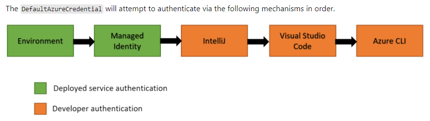

# Azure Key Vault (AKV)

##Key benefits of using Azure Key Vault:
- **Centralized application secrets**: Centralizing storage of application secrets in Azure Key Vault allows you to control
  their distribution
- **Securely store secrets and keys**: Access to a key vault requires proper authentication and authorization before a caller 
  (user or application) can get access. Authentication is done via Azure Active Directory
- **Monitor access and use**: You can monitor activity by enabling logging for your vaults. 
  Azure Key Vault can be configured to:
  - Archive to a storage account
  - Stream to an event hub
  - Send the logs to Azure Monitor logs
- **Simplified administration of application secrets**: Azure Key Vault simplifies the process of meeting these requirements by:
  - Removing the need for in-house knowledge of Hardware Security Modules
  - Scaling up on short notice to meet your organization’s usage spikes
  - Replicating the contents of your Key Vault within a region and to a secondary region. Data replication ensures high 
    availability and takes away the need of any action from the administrator to trigger the failover
  - Providing standard Azure administration options via the portal, Azure CLI and PowerShell
  - Automating certain tasks on certificates that you purchase from Public CAs, such as enrollment and renewal
    
## What to store:
- keys -> cryptographic keys
- secrets -> sensitive connections strings or passwords
- certificates -> used for Https/TLS
  - these can be also generated by AKV (Azure Key Vault) or even purchased through AKV

## Discover Azure Key Vault best practices
### Authentication
- Authentication with Key Vault works in conjunction with Azure Active Directory, which is responsible for authenticating 
  the identity of any given security principal
- There are three ways to authenticate to Key Vault:
  - **Managed identities for Azure resources**: 
    - we can manually create identities, using the **Managed Identities** Azure service
    - we can use a system assigned identity, for the services that can have an identity (user managed or system assigned), 
      such as App Service and Azure Functions
  - **Service principal and certificate**: You can use a service principal and an associated certificate that has access to 
    Key Vault. We don't recommend this approach because the application owner or developer must rotate the certificate
  - **Service principal and secret**: Although you can use a service principal and a secret to authenticate to Key Vault,
    we don't recommend it. It's hard to automatically rotate the bootstrap secret that's used to authenticate to Key Vault.
## Azure Key Vault best practices
- **Use separate key vaults**: It is recommended to use a vault per application per environment (Development, 
  Pre-Production and Production). This helps you not share secrets across environments and also reduces the threat 
  in case of a breach
- Control access to your vault: Key Vault data is sensitive and business critical, you need to secure access to your
  key vaults by allowing only authorized applications and users
- Backup: Create regular backups of your vault on update/delete/create of objects within a Vault.

Logging: Be sure to turn on logging and alerts.

Recovery options: Turn on soft-delete and purge protection if you want to guard against force deletion of the secret.

## Various options
- in order to access the vault, access policies need to be set for the users that will access the vault
- if the vault is created from the CLI, no access policies will be set, and they need to be added manually

## Creating an app that uses the vault
- The application in this project is created mostly based on [this page](https://github.com/Azure/azure-sdk-for-java/tree/main/sdk/keyvault/azure-security-keyvault-secrets#create-secret-client) 
- Steps:
  1. create the vault and from the overview page grab the vault url, needed for the app
  2. we then need to register this application to the vault. There are several ways to do this:
     1. Using **Managed identities for Azure resources**, the application can access the key vault only from within Azure
        - create an App Service application
        - create an identity for this app service -> in the app service page, go to the Identity section. There are 2 options here
          - "System assigned" identity tab, toggle the status to ON
          - "User assigned" identity tab -> for this, a managed identity needs to be previously created and added here. 
             There is a "Managed Identity" Azure service for this
          - in either case, get the created object id of the newly created identity
        - go back to the key vault and add a policy for the newly created app service. Basically add te previously created identity
          and add some permissions (access policies for keys, secrets or certificates) for accessing the key vault
        - deploy the app in App Service. That's it, and it all works because the App Service app is registered with the key vault
     2. By **registering the application with AAD**, then using the **Service principal and a secret** or the **Service principal and certificate**, 
        the application can access the vault from inside Azure, relying on some environment variables, or from outside Azure,
        programmatically, using an `AzureCredentialBuilder`
        - for this to be possible, we need to register the application with Azure AD
        - in AAD go to App registrations, and register a new app
        - go to the "Certificates & secrets" page of the newly registered app, and create a new secret (a password)
        - wherever you deploy the app, set this environment variables (all of them can be accessed via the overview page of the newly registered app)
             - AZURE_CLIENT_ID=the newly registered app id
             - AZURE_TENANT_ID=the tenant id (not sure if this is the tenant id of the app, or the one of the key vault)
             - AZURE_CLIENT_SECRET=the newly created app password
        - Because I used the `DefaultAzureCredentialBuilder` which, on the build method also creates a `DefaultAzureCredential`. 
          Among those credentials there is a `EnvironmentCredential` which is added and this credential relies on the
          mentioned environment variables (it can also construct the credentials based on other values, such as AZURE_CLIENT_CERTIFICATE_PATH).  
          See the class definition
        - this means that if the App Service application has these env variables in the configuration properties, it 
          doesn't event needs to be registered with the key vault as previously done. The problem with this approach is that 
          the credentials ust be stored in the repo, which of course, is a bad idea
         
- Of course, a combination of the 2 above, is possible, so that the app can be accessed from both within and outside Azure

## Using key vault references
- Problem: 
  - we have some application config properties that are sensitive, and we don't want to expose them on the repository
- Solution: 
  - we now we can store secrets in the key vault
  - create a secret in the key vault with the sensitive info   
  - in the app configuration page, instead of setting the value of the property, set a reference to the newly created 
    key vault entry. there is a special syntax to create this reference:
    `@Microsoft.KeyVault(SecretUri=https://myvault.vault.azure.net/secrets/mysecret/)`
    or `@Microsoft.KeyVault(VaultName=myvault;SecretName=mysecret)`
  - the version of the secret can also be included in the reference string
  - additional details [here](https://docs.microsoft.com/en-us/azure/app-service/app-service-key-vault-references)

## Key vault data soft delete and purge protection
- soft delete is enabled for all new key vaults. For existing ones it has to be manually enabled
- after the item is deleted, it has a retention policy of a min of 7 to a max of 90 days 
- after the item is deleted, it can be immediately purged manually (permanently deleted), or automatically purged,
  after the retention period has passed
- Azure key vault purge protection: when purge protection is enabled, a vault or an object in the deleted state cannot
  be purged util the retention period has passed
- once the purge protection is enabled, it cannot be disabled
- if not enabled from the start, at the vault creation, purge protection can also be later enabled

## Working with keys
- in the key vault we have the option to import a key, generate one or restore one
- this key can be used with other Azure services for encryption purposes (encrypt DM disks, storage accounts and so on).
  For example, remember that the storage account encrypts data at rest. By default, the encryption key is generated and 
  managed by Azure, but we can change that in the "Encryption" section in the Storage Account and set our own encryption key, 
  by specifying an url where to find it, or by selecting it from the vault. Of course, if the key is later purged,
  the Storage Account data becomes inaccessible
- Because of the dangers of purging the key, soft delete and purge protection are automatically enable on the key vault
  when allocating a key for encryption
- Also, the storage itself is registered with the key vault and receives an application access policy

## Working with certificates
- just like working with key and secrets