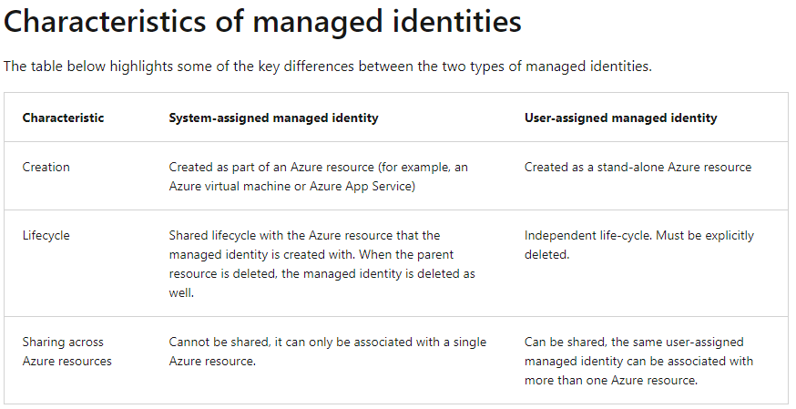

# Implement managed identities
- Managed identities provide an identity for applications to use when connecting to resources that support 
  Azure Active Directory (Azure AD) authentication
- Applications may use the managed identity to obtain Azure AD tokens. For example, an application may use a managed 
  identity to access resources like Azure Key Vault where developers can store credentials in a secure manner or
  to access storage accounts

## Types of managed identities
- **System-assigned managed identity**: is enabled directly on an Azure service instance
  - When the identity is enabled, Azure creates an identity for the instance in the Azure AD tenant that's trusted by 
    the subscription of the instance
  - The lifecycle of a system-assigned identity is directly tied to the Azure service instance that it's enabled on. If
    the instance is deleted, Azure automatically cleans up the credentials and the identity in Azure AD
- **User-assigned managed identity**: is created as a standalone Azure resource
  - After the identity is created, the identity can be assigned to one or more Azure service instances
  - The lifecycle of a user-assigned identity is managed separately from the lifecycle of the Azure service instances
    to which it's assigned

[Azure services that can use managed identities to access other services](https://docs.microsoft.com/en-us/azure/active-directory/managed-identities-azure-resources/managed-identities-status)



## Configure managed identities
You can configure an Azure virtual machine with a managed identity during, or after, the creation of the virtual machine.

### System-assigned managed identity
To create, or enable, an Azure virtual machine with the system-assigned managed identity your account needs the 
**Virtual Machine Contributor** role assignment. 

Enable system-assigned managed identity during creation of an Azure virtual machine
```
az vm create `
    --resource-group myResourceGroup ` 
    --name myVM `
    --image win2016datacenter ` 
    --generate-ssh-keys `
    --assign-identity `
    --admin-username azureuser ` 
    --admin-password myPassword12
```

Enable system-assigned managed identity on an existing Azure virtual machine
```
az vm identity assign -g myResourceGroup -n myVm
```

### User-assigned managed identity
To assign a user-assigned identity to a virtual machine during its creation, your account needs the 
**Virtual Machine Contributor** and **Managed Identity Operator** role assignments

Assign a user-assigned managed identity during the creation of an Azure virtual machine
```
az vm create `
  --resource-group <RESOURCE GROUP> `
  --name <VM NAME> `
  --image UbuntuLTS `
  --admin-username <USER NAME> `
  --admin-password <PASSWORD> `
  --assign-identity <USER ASSIGNED IDENTITY NAME>
```

Assign a user-assigned managed identity to an existing Azure virtual machine
```
az vm identity assign `
    --resource-group <RESOURCE GROUP> `
    --name <VM NAME> `
    --identities <USER ASSIGNED IDENTITY>
```