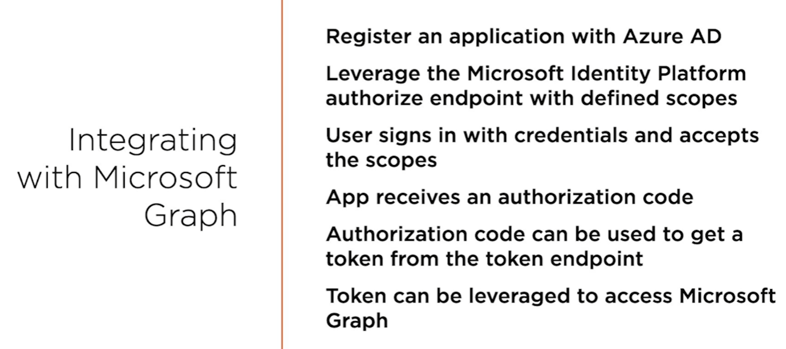

# Creating the app
The application in this project is created based on [here](https://github.com/microsoftgraph/msgraph-training-java/tree/main/demo):

Before running the app, it must be registered with Azure
Steps:
1. go to AAD/App Registrations
2. create new registration -> check this option: 
    `Accounts in any organizational directory (Any Azure AD directory - Multitenant) and personal Microsoft accounts (e.g. Skype, Xbox)`
3. because this is a desktop application, add `https://login.microsoftonline.com/common/oauth2/nativeclient` as the redirect URI
4. copy the client id from the newly created registration overview page
5. in the oAuth.properties set the client id and the permissions(scopes) that the application needs and for which it should request approval
6. when the app is started look in the console for authentication instructions. you should find something like this:
   `To sign in, use a web browser to open the page https://microsoft.com/devicelogin and enter the code DDY6LYCAF to authenticate.`
7. Note that there are 2 apps in this maven/springboot project and even if you start this app on its own, the logging dependencies 
   will kick in 

